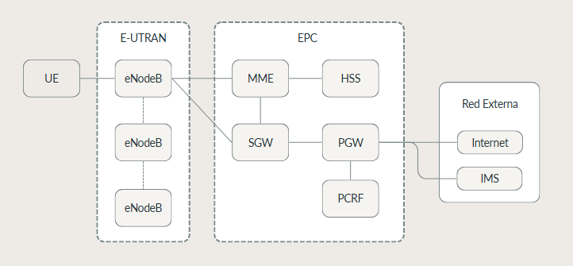

# 📡 Investigación: Redes 4G LTE

## 1. ¿Qué es LTE?

**LTE (Long Term Evolution)** es el estándar de comunicaciones móviles de cuarta generación (4G) definido por el 3GPP (3rd Generation Partnership Project). Representa una evolución de las redes 3G/UMTS hacia una arquitectura completamente basada en IP, eliminando los dominios de circuitos de voz tradicionales.

### Características principales

| Característica | Valor |
|---|---|
| Velocidad bajada teórica | Hasta 150 Mbps (FDD) |
| Velocidad subida teórica | Hasta 50 Mbps |
| Latencia | < 10 ms (plano de usuario) |
| Arquitectura | All-IP (todo sobre paquetes) |
| Estándar base | 3GPP Release 8 (2008) |

---

## 2. Arquitectura de Red LTE — EPS

El sistema LTE se denomina **EPS (Evolved Packet System)** y está formado por dos grandes bloques:

```
[ UE ] ←— Radio (LTE-Uu) —→ [ E-UTRAN ] ←— S1 —→ [ EPC ] ←→ Internet / IMS
```

### 2.1 UE — User Equipment (Dispositivo Móvil)

El UE es cualquier dispositivo que se conecta a la red. Internamente tiene:
- **ME (Mobile Equipment):** el hardware del teléfono.
- **UICC / SIM:** tarjeta inteligente con credenciales de autenticación (IMSI, Ki, etc.).

### 2.2 E-UTRAN — Evolved UMTS Terrestrial Radio Access Network

Es la capa de acceso radio. Su único nodo es:

- **eNodeB (eNB):** La antena base. A diferencia de 3G, en LTE el eNB tiene inteligencia propia (no necesita un RNC separado). Se conecta con otros eNBs mediante la interfaz **X2** y con el core mediante la interfaz **S1**.

### 2.3 EPC — Evolved Packet Core

El corazón de la red. Sus nodos principales son:

| Nodo | Nombre completo | Función |
|---|---|---|
| **MME** | Mobility Management Entity | Gestión de movilidad, autenticación y señalización NAS |
| **SGW** | Serving Gateway | Gateway del plano de usuario; ancla el tráfico en handovers |
| **PGW** | PDN Gateway | Punto de salida hacia Internet; asigna IPs, aplica QoS |
| **HSS** | Home Subscriber Server | Base de datos de suscriptores (IMSI, perfil, claves) |
| **PCRF** | Policy and Charging Rules Function | Reglas de calidad de servicio y facturación |

---

## 3. Interfaces Clave



| Interfaz | Entre | Protocolo |
|---|---|---|
| LTE-Uu | UE ↔ eNB | PDCP, RLC, MAC, PHY |
| S1-MME | eNB ↔ MME | S1AP (sobre SCTP) |
| S1-U | eNB ↔ SGW | GTP-U (sobre UDP) |
| S6a | MME ↔ HSS | Diameter |
| S11 | MME ↔ SGW | GTPv2-C |
| S5/S8 | SGW ↔ PGW | GTPv2-C / GTP-U |

---

## 4. Procedimiento de Conexión (Attach)

```
UE → eNB → MME : Attach Request (IMSI)
MME → HSS      : Authentication Information Request
HSS → MME      : Authn. Info Answer (vectores AKA)
MME → UE       : Authentication Request (RAND, AUTN)
UE  → MME      : Authentication Response (RES)
MME → UE       : Security Mode Command (algoritmos de cifrado)
UE  → MME      : Security Mode Complete
MME → SGW/PGW  : Create Session Request
PGW → UE       : Asignación de IP
UE             : Attach Accept / Attach Complete
```

---

## 5. Planos de Red

### Plano de Control (Control Plane)
Maneja señalización: autenticación, gestión de sesiones, movilidad. Protocolos: NAS, S1AP, GTPv2-C, Diameter.

### Plano de Usuario (User Plane)
Transporta datos del usuario encapsulados en túneles GTP-U sobre UDP/IP.

---

## 6. Seguridad en LTE

### Autenticación: EPS-AKA
LTE usa el protocolo **EPS-AKA (Authentication and Key Agreement)** derivado de UMTS-AKA:
- Basado en criptografía simétrica (clave `Ki` compartida entre SIM y HSS).
- Produce claves de sesión: `K_ASME` → `K_NAS`, `K_RRC`, `K_UP`.

### Cifrado y Protección de Integridad
- **NAS:** cifrado + integridad entre UE y MME.
- **RRC:** cifrado + integridad entre UE y eNB.
- **UP:** solo cifrado (sin integridad por defecto — punto crítico de seguridad).

### Algoritmos soportados
| Código | Nombre | Notas |
|---|---|---|
| EEA0 | Nulo | Sin cifrado (usado en emergencias) |
| EEA1 | SNOW 3G | |
| EEA2 | AES-CTR | El más usado |
| EEA3 | ZUC | |

---

## 7. Puntos de Vulnerabilidad Conocidos

> Ver detalle en [`03_vectores_ataque.md`](03_vectores_ataque.md)

- **IMSI Catching:** El IMSI puede ser capturado antes de que se active el cifrado si el atacante fuerza un attach con red falsa (IMSI Catcher / Stingray).
- **Falta de cifrado en plano de usuario (UP):** el estándar no obliga cifrado en el plano de usuario, dejando los datos expuestos si el eNB es comprometido.
- **Ataques de downgrade:** forzar al UE a conectarse a 2G/3G donde la seguridad es menor.
- **Redirección de tráfico VoLTE:** si el tráfico RTP no está correctamente protegido con SRTP/SDES, puede ser interceptado.

---

## 8. Referencias

- 3GPP TS 23.401 — General Packet Radio Service (GPRS) enhancements for E-UTRAN access
- 3GPP TS 33.401 — 3GPP System Architecture Evolution (SAE); Security architecture
- 3GPP TS 36.300 — E-UTRA and E-UTRAN Overall description
- Raza, H. (2011). *A Brief Overview of LTE*. Internet Protocol Journal.
