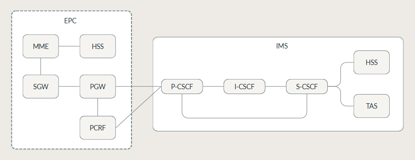

# ☎️ Investigación: VoLTE — Voice over LTE

## 1. ¿Qué es VoLTE?

LTE fue diseñado desde su origen como una red exclusivamente de conmutación de paquetes, sin un dominio de circuitos para voz como el de GSM/UMTS. Esto planteó a la industria el problema de cómo ofrecer servicio de voz sobre una red LTE pura. La solución estandarizada por el 3GPP y adoptada por la GSMA es **VoLTE (Voice over LTE)**, que transporta la voz como tráfico IP (RTP) sobre un bearer dedicado de LTE, con la señalización de la llamada gestionada por el **IMS (IP Multimedia Subsystem)**.

Antes de VoLTE, los operadores usaban **CSFB (Circuit-Switched Fallback):** cuando entraba una llamada, el dispositivo "caía" a 2G/3G para manejarla. VoLTE elimina eso completamente.

Este documento describe la arquitectura del IMS, el protocolo SIP como base de su señalización, y el ciclo de vida completo de una llamada VoLTE, estableciendo la base conceptual para el análisis de vulnerabilidades.

---

## 2. IMS — IP Multimedia Subsystem

El IMS es un subsistema definido por 3GPP (TS 23.228) para ofrecer servicios multimedia sobre IP, independiente del acceso radio subyacente. Sus elementos centrales son los **CSCF (Call Session Control Function)**:



### Componentes del IMS

| Nodo | Nombre | Función |
|---|---|---|
| **P-CSCF** | Proxy-CSCF | Primer punto de contacto del UE con el IMS. Recibe toda la señalización SIP del terminal, aplica políticas de seguridad (IPSec/TLS) y reenvía al S-CSCF. |
| **I-CSCF** | Interrogating-CSCF | Consulta al HSS para determinar qué S-CSCF debe atender a un usuario. |
| **S-CSCF** | Serving-CSCF | Núcleo de control de sesión. Autentica al usuario, mantiene el estado del registro, aplica lógica de servicio (routing de llamadas, filtros) y es el elemento más crítico de todo el IMS. |
| **AS** | Application Server | Lógica de servicios: buzón de voz, conferencia, etc. |
| **HSS** | Home Subscriber Server | Base de datos de suscriptores (compartida con EPC). |
| **MGCF** | Media Gateway Control Function | Interconecta el plano de medios IMS con otras redes (PSTN, otros operadores) y gestiona el establecimiento del flujo RTP. |

---

## 3. Protocolos de VoLTE

VoLTE combina tres protocolos clave:

### 3.1 SIP — Session Initiation Protocol
- RFC 3261
- Protocolo de señalización para establecer, modificar y terminar sesiones multimedia.
- Funciona sobre UDP o TCP (en IMS generalmente TCP o TLS).

     | Método | Función |
     |---|---|
     | `REGISTER` | Registro del UE ante el S-CSCF (vincula la identidad IMPU con la ubicación de contacto) |
     | `INVITE` | Inicio de una sesión (llamada), incluye el **SDP** (Session Description Protocol) con IP/puerto de media y codecs propuestos |
     | `ACK` | Confirma la respuesta final a un INVITE |
     | `BYE` | Termina una sesión activa |
     | `CANCEL` | Cancela un INVITE aún no respondido |
     | `200 OK` / `180 Ringing` / `486 Busy` / `403 Forbidden` | Respuestas de estado |

### 3.2 SDP — Session Description Protocol
- RFC 4566
- Describe los parámetros de la sesión multimedia (codec, IP, puerto RTP, etc.).
- Se transporta dentro del cuerpo de los mensajes SIP (INVITE).

### 3.3 RTP / RTCP — Real-time Transport Protocol
- RFC 3550
- Transporta los datos de voz en tiempo real (paquetes de audio codificado).
- RTCP: control y estadísticas de la sesión.
- Codecs comunes en VoLTE: **AMR-WB** (HD Voice), **AMR-NB**, **EVS**.

---

## 4. Flujo de una Llamada VoLTE

```
Llamante (UE-A)                IMS (Kamailio)         Llamado (UE-B)
     |                               |                       |
     |── REGISTER ──────────────────>|                       |
     |<─ 200 OK ─────────────────────|                       |
     |                               |                       |
     |── INVITE (SDP offer) ────────>|                       |
     |                               |── INVITE ────────────>|
     |                               |<─ 180 Ringing ────────|
     |<─ 180 Ringing ────────────────|                       |
     |                               |<─ 200 OK (SDP ans.) ──|
     |<─ 200 OK ─────────────────────|                       |
     |── ACK ─────────────────────── |──────────────────────>|
     |                               |                       |
     |══════════ RTP (voz) ══════════════════════════════════|
     |                               |                       |
     |── BYE ─────────────────────── |──────────────────────>|
     |<─ 200 OK ─────────────────────|───────────────────────|
```

---

## 5. QoS en VoLTE — Bearers y QCI

Una vez registrado, cuando el UE inicia una llamada, la red debe garantizar una calidad de servicio adecuada para el tráfico de voz en tiempo real. Esto se logra mediante:

     1. El P-CSCF, al observar el SDP negociado en el INVITE, informa al **PCRF** (vía la interfaz Rx) los parámetros de la sesión de media.
     2. El PCRF traduce esto en una regla PCC (Policy and Charging Control) que se entrega al PGW (interfaz Gx).
     3. El PGW, junto al SGW y el eNodeB, establece un **Dedicated Bearer** con **QCI=1** (conversacional, prioridad de scheduling alta, retardo objetivo ~100 ms, tasa de pérdida de paquetes objetivo 10⁻²).

Este *bearer* (portadoras) dedicado es el que transporta el tráfico RTP durante toda la llamada, separado del Default Bearer usado para datos generales (navegación, señalización SIP).

| Bearer | QCI | Uso | Características |
|---|---|---|---|
| Default bearer | 9 | Datos generales | Best effort |
| Dedicated bearer | 1 | RTP (voz VoLTE) | GBR, baja latencia, alta prioridad |
| Dedicated bearer | 5 | SIP (señalización IMS) | Non-GBR, alta prioridad |

- **QCI 1:** Garantiza latencia < 100 ms y pérdida de paquetes < 0.01% para voz.
- **GBR (Guaranteed Bit Rate):** La red reserva ancho de banda para el bearer de voz.

---

## 6. Superficies de Riesgo Introducidas por VoLTE

La incorporación del IMS añade una capa de señalización adicional (SIP/Diameter) y un plano de media (RTP) que no existían en LTE puro, ampliando la superficie de ataque respecto de una red LTE de solo datos:

- **Plano de señalización SIP**: expuesto a interceptación, DoS por inundación de mensajes, y manipulación de identidad si no se validan correctamente los headers de autenticación.
- **Plano de media RTP**: expuesto a interceptación si la sesión SIP revela IP/puerto de forma clara y el cifrado radio (EEA) está deshabilitado o es débil.
- **Interfaces Diameter (Cx, Rx, Gx)**: interfaces internas normalmente no expuestas a un atacante externo, pero relevantes si el atacante logra posicionarse dentro de la red del operador (escenario que el laboratorio emula mediante acceso a la red bridge de Docker).

---

## 7. Diferencias entre VoLTE y VoIP convencional

| Aspecto | VoIP (ej. SIP genérico) | VoLTE (IMS) |
|---|---|---|
| Red de transporte | Internet pública | Red LTE gestionada |
| QoS | Best effort | Bearers dedicados con QCI |
| Seguridad | Opcional | IPSec/TLS obligatorio (estándar) |
| Registro | Servidor SIP libre | HSS del operador |
| Codecs | Variado | AMR-WB / EVS (estandarizados) |
| Emergencias | Variable | Soporte E911/E112 integrado |

---

## 8. Referencias

- GSMA IR.92 — IMS Profile for Voice and SMS
- 3GPP TS 23.228 — IP Multimedia Subsystem (IMS); Stage 2
- 3GPP TS 24.229 — IP multimedia call control protocol based on SIP and SDP
- 3GPP TS 33.203 — 3G Security; Access security for IP-based services.
- RFC 3261 — SIP: Session Initiation Protocol
- RFC 3550 — RTP: A Transport Protocol for Real-Time Applications
- RFC 3711 — The Secure Real-time Transport Protocol (SRTP)
- RFC 3325 — Private Extensions to SIP for Asserted Identity.
- RFC 5630 — The Use of the SDES Key Management Method with SIP.


---

**Siguiente documento:** [`03_vectores_ataque.md`](03_vectores_ataque.md) — Superficie de ataque y vulnerabilidades.
