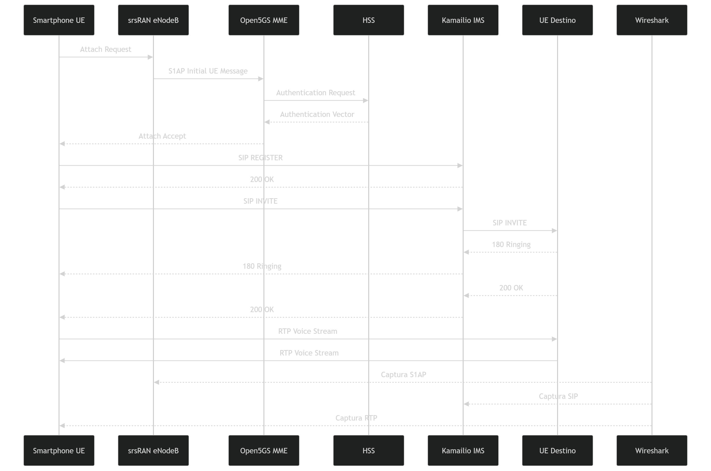

# 📞 Flujo Completo de una Llamada VoLTE en el Laboratorio

## 1. Visión General

Este documento integra, en una sola línea de tiempo, los componentes descritos en `docs/01_investigacion/01_redes_4G_LTE.md` y la arquitectura `../01_investigacion/02_VoLTE.md`, mostrando el ciclo de vida completo de una llamada VoLTE emulada en el laboratorio: desde que el UE enciende hasta que la llamada termina. 

Una llamada VoLTE involucra **tres fases principales** y cruza múltiples capas de la red:

```
Fase 1: REGISTRO IMS    → El UE se registra en el servidor SIP (Kamailio)
Fase 2: ESTABLECIMIENTO → Negociación SIP (INVITE / 200 OK / ACK)
Fase 3: CONVERSACIÓN    → Flujo de audio RTP entre UE y Asterisk
Fase 4: TERMINACIÓN     → BYE / 200 OK
```

---

## 2. Prerrequisito: Attach LTE (antes de la llamada)

Antes de cualquier llamada VoLTE, el UE debe haberse **adjuntado a la red LTE** y tener asignada una IP.



---

## 3. Etapas Detalladas

### Etapa 1 — EPS Attach (capa LTE)

| Paso | Descripción | Filtro Wireshark |
|---|---|---|
| 1.1 | `srsUE` envía **Attach Request** vía NAS, encapsulado en S1-AP hacia el MME | `s1ap` |
| 1.2 | MME solicita vectores de autenticación al HSS (**S6a**) | `diameter` |
| 1.3 | Se ejecuta **EPS-AKA**: desafío/respuesta entre UE y red | `nas-eps` |
| 1.4 | MME activa contexto de seguridad NAS (cifrado/integridad) | `nas-eps.security_header_type` |
| 1.5 | MME solicita creación de sesión al SGW/PGW (**S11**) | `gtpv2` |
| 1.6 | PGW asigna IP del rango `10.45.0.0/16`; MME confirma **Attach Accept** | `nas-eps` |

**Punto de interés para V4:** el `SecurityModeCommand` del paso 1.4 es donde queda registrado el algoritmo EEA/EIA efectivamente negociado; su verificación en el log de `srsenb` es la evidencia central del vector de cifrado radio.

### Etapa 2 — Registro IMS

| Paso | Descripción | Filtro Wireshark |
|---|---|---|
| 2.1 | UE envía `REGISTER` al P-CSCF (interfaz Gm) | `sip.Method == "REGISTER"` |
| 2.2 | P-CSCF reenvía al S-CSCF; S-CSCF consulta al FHoSS vía Diameter **Cx** | `diameter` |
| 2.3 | S-CSCF responde `401 Unauthorized` con desafío (SIP Digest AKA) | `sip.Status-Code == 401` |
| 2.4 | UE reenvía `REGISTER` con `Authorization` calculado | `sip.Method == "REGISTER"` |
| 2.5 | S-CSCF valida y responde `200 OK`; UE queda registrado | `sip.Status-Code == 200` |

**Punto de interés para V2 (sub-escenario 2a):** este es exactamente el flujo que un `REGISTER Flood` satura, agotando la tabla de diálogos del S-CSCF.

### Etapa 3 — Establecimiento de Sesión (Llamada)

| Paso | Descripción | Filtro Wireshark |
|---|---|---|
| 3.1 | UE-A envía `INVITE` con SDP (codec, IP/puerto de media) al P-CSCF | `sip.Method == "INVITE"` |
| 3.2 | P-CSCF informa al PCRF (Rx) para reservar el **Dedicated Bearer QCI=1** | `diameter` |
| 3.3 | S-CSCF enruta el `INVITE` hacia UE-B (a través de Asterisk como media anchor) | `sip.Method == "INVITE"` |
| 3.4 | UE-B responde `180 Ringing` y luego `200 OK` con su propio SDP | `sip.Status-Code == 180 \|\| sip.Status-Code == 200` |
| 3.5 | UE-A confirma con `ACK`; la sesión queda establecida | `sip.Method == "ACK"` |

**Punto de interés para V1:** el `INVITE` del paso 3.1 es el mensaje objetivo de la interceptación MITM — contiene toda la información SDP necesaria para localizar el flujo RTP.

**Punto de interés para V3:** el header `From` del `INVITE` (paso 3.1) es el campo forjado en el ataque de suplantación; su validación depende de que el S-CSCF compruebe `P-Asserted-Identity` contra el registro autenticado en la Etapa 2.

### Etapa 4 — Media (Voz)

| Paso | Descripción | Filtro Wireshark |
|---|---|---|
| 4.1 | Flujo RTP bidireccional entre UE-A y UE-B, encapsulado en GTP-U sobre el bearer dedicado QCI=1 | `rtp` / `gtp` |

**Punto de interés para V4:** si el cifrado radio está en `EEA0`, este es el tráfico que queda legible en la captura de `ogstun`.

**Punto de interés para V6:** el túnel GTP-U de esta etapa es el objetivo de la inyección de paquetes con TEID conocido.

### Etapa 5 — Terminación

| Paso | Descripción | Filtro Wireshark |
|---|---|---|
| 5.1 | Cualquiera de las partes envía `BYE` | `sip.Method == "BYE"` |
| 5.2 | La otra parte confirma con `200 OK` | `sip.Status-Code == 200` |
| 5.3 | El PCRF libera el Dedicated Bearer QCI=1 | `diameter` |

**Punto de interés para V7:** un `BYE` forjado sin verificación de los tags `From`/`To` del diálogo puede terminar la llamada de forma prematura sin haber participado en ella.

---

## 4. Correlación Ciclo de Vida ↔ Vectores de Ataque

| Etapa | Vectores aplicables |
|---|---|
| EPS Attach | V4 (cifrado radio), V5 (rogue eNodeB, en la fase de selección de celda previa al Attach) |
| Registro IMS | V2a (REGISTER Flood) |
| Establecimiento de sesión | V1 (MITM SDP), V2b (Transaction Exhaustion), V3 (suplantación) |
| Media (RTP) | V4 (cifrado radio), V6 (GTP-U injection) |
| Terminación | V7 (BYE forjado) |

Esta tabla resume por qué la metodología de cuatro fases (reconocimiento, análisis de configuración, explotación, validación de contramedida) se aplica de forma independiente a cada vector: cada uno interviene en una etapa distinta del ciclo de vida, con su propio punto de captura y su propia condición de éxito.

---

## 5. Referencias

- 3GPP TS 24.301 — Non-Access-Stratum (NAS) protocol for EPS.
- 3GPP TS 24.229 — IP Multimedia Call Control Protocol based on SIP and SDP.
- RFC 3261 — SIP: Session Initiation Protocol.
- GSMA IR.92 — IMS Profile for Voice and SMS.

---

**Documento anterior:** [`01_diagrama_laboratorio.md`](01_diagrama_laboratorio.md) — Topología del laboratorio.
